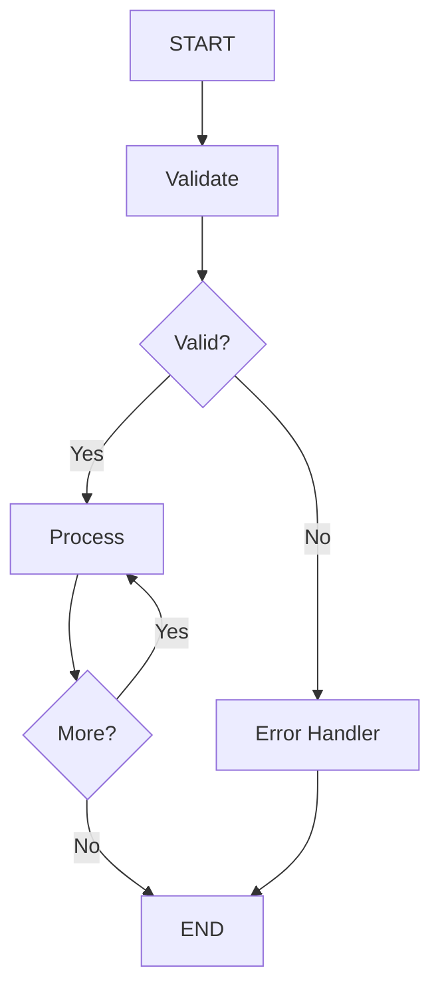

# Architecture Overview

This document explains the design philosophy, patterns, and architectural decisions behind the Spring AI Agent Patterns
project.

## Design Philosophy

This project demonstrates **production-ready agentic workflows** through three core principles:

1. **Transparency Over Magic**: Every design decision is documented with rationale. Debugging insights show real
   problems and solutions.
2. **Reliability Over Cleverness**: Choose patterns that degrade gracefully and produce debuggable outputs over complex
   optimizations.
3. **Extensibility Over Completeness**: Provide reusable components and clear extension points rather than trying to
   cover every use case.

## Technology Stack Rationale

### Why LangGraph4j?

**LangGraph4j** provides stateful workflow orchestration with:

- **Explicit State Management**: Type-safe state with clear data flow
- **Conditional Routing**: Dynamic workflow paths based on runtime state
- **Loop Support**: Iterative processing without recursion complexity
- **Debuggability**: Each node execution is discrete and inspectable

**Alternatives Considered:**

- **Spring State Machine**: Too heavyweight, designed for business workflows, not LLM orchestration
- **Spring Functions**: Limited state management, lacks declarative graph definition
- **Raw Spring**: Manual state management is error-prone and boilerplate-heavy
- **LangChain4j**: Less flexible state management, couples too tightly to specific LLM providers

**Why LangGraph4j Wins**: Strikes the balance between structure and flexibility. Nodes are simple functions, state is
explicit, and the graph definition is declarative.

### Why Spring AI?

**Spring AI** provides LLM integration with:

- **Provider Abstraction**: Switch between Ollama, OpenAI, Anthropic without code changes
- **Tool Calling Support**: First-class support for function calling with ToolCallback
- **MCP Integration**: Native support for Model Context Protocol servers
- **Spring Ecosystem**: DI, configuration, observability all integrate naturally

**Key Pattern**: Spring AI handles LLM communication and tool routing, LangGraph4j handles workflow orchestration. Clean
separation of concerns.

### Why Kotlin?

- **Null Safety**: Eliminates an entire class of bugs in state management
- **Data Classes**: Concise, immutable state objects
- **Extension Functions**: Clean utility code without inheritance
- **Java Interop**: Full access to Spring and LangGraph4j (Java libraries)

## Core Architectural Patterns

### 1. Stateful Workflow Orchestration

Both examples use the **StateGraph** pattern:

```kotlin
StateGraph(MyState.SCHEMA) { initData -> MyState(initData) }
    .addNode("node1", node_async(Node1()))
    .addNode("node2", node_async(Node2()))
    .addEdge(StateGraph.START, "node1")
    .addEdge("node1", "node2")
    .addEdge("node2", StateGraph.END)
    .compile()
```

**Key Components:**

- **State Class**: Extends `AgentState`, provides type-safe accessors
- **Schema**: Defines input keys with merge strategies
- **Nodes**: Implement `NodeAction<State>`, return state updates
- **Edges**: Static (`addEdge`) or conditional (`addConditionalEdges`)
- **Compilation**: Produces executable graph

### 2. Minimalist State Schema

Both examples follow the **"Only Define Inputs"** pattern:

```kotlin
class MyState(initData: Map<String, Any>) : AgentState(initData) {
    companion object {
        const val INPUT_KEY = "input"
        const val OUTPUT_KEY = "output"

        // Only input keys in schema
        val SCHEMA: Map<String, Channel<*>> = mapOf(
            INPUT_KEY to Channels.base<String>({ _, o2 -> o2 }, { "" }),
        )
    }

    fun input(): String = value<String>(INPUT_KEY).orElseThrow()
    fun output(): String? = value<String>(OUTPUT_KEY).orElse(null)
}
```

**Rationale:**

- **Input Keys**: Need explicit merge strategies (e.g., append, last-write-wins)
- **Output Keys**: Use default "last write wins" behavior (simpler)
- **Type Safety**: Accessor methods provide compile-time safety despite dynamic schema

**Benefits:**

- Less boilerplate (no need to define every key)
- Easier to extend (add new output keys without schema changes)
- Clear separation between external inputs and internal state

**When This Works:**

- Linear workflows (nodes don't write to same keys)
- Conditional routing (no complex state merging)

**When You Need More:**

- Parallel nodes writing to same keys (need custom merge logic)
- Accumulation across loops (though manual accumulation works fine - see Research Report Writer)

### 3. Node Design Pattern

Nodes are stateless functions that transform state:

```kotlin
class MyNode : NodeAction<MyState> {
    override fun apply(state: MyState): Map<String, Any> {
        // 1. Read inputs from state
        val input = state.input()

        // 2. Do work (call LLM, tools, etc.)
        val result = processInput(input)

        // 3. Return state updates
        return mapOf(OUTPUT_KEY to result)
    }
}
```

**Key Principles:**

- **Stateless**: Node instances have no mutable state
- **Pure Functions**: Same input state → same output updates (except for LLM calls)
- **Fail Gracefully**: Catch exceptions, return error state instead of throwing
- **Single Responsibility**: Each node does one logical step

**Benefits:**

- **Testable**: Easy to unit test with mock state
- **Composable**: Nodes can be reused in different graphs
- **Debuggable**: Can inspect state before/after each node

### 4. Structured Output Pattern

Both examples use **BeanOutputConverter** for type-safe LLM outputs:

```kotlin
val prompt = """
    Generate a research plan...

    Output ONLY valid JSON matching this exact structure:
    {
      "sections": [
        {"title": "...", "researchQuestions": ["..."], "keyTopics": ["..."]}
      ],
      "overallObjective": "..."
    }
""".trimIndent()

val chatOptions = OllamaOptions.builder()
    .format(beanOutputConverterCache.getConverter(ResearchPlan::class.java).jsonSchemaMap)
    .build()

val result = chatModel.call(Prompt(UserMessage(prompt), chatOptions))
    .results[0].output.text

val plan = beanOutputConverterCache.getConverter(ResearchPlan::class.java)
    .convert(result)
```

**Why This Pattern:**

- **Type Safety**: Kotlin data classes define schema at compile time
- **Validation**: Deserialization fails fast if LLM generates invalid JSON
- **Examples**: Prompt includes explicit JSON example for reliability

## Key Utility: BeanOutputConverterCache

### Problem Statement

Spring AI's `BeanOutputConverter` generates JSON schemas from Java classes via reflection. This is expensive:

```kotlin
// Without caching
val converter1 = BeanOutputConverter(ResearchPlan::class.java)  // Reflection
val converter2 = BeanOutputConverter(ResearchPlan::class.java)  // Reflection again!
```

Each converter creation:

1. Reflects over the class structure
2. Builds JSON schema representation
3. Creates format map for LLM

For repeated calls (like in loops), this is wasteful.

### Solution: Thread-Safe Caching

```kotlin
@Component
class BeanOutputConverterCache {
    private val cache = Collections.synchronizedMap(
        mutableMapOf<Class<*>, BeanOutputConverter<*>>()
    )

    fun <T> getConverter(clazz: Class<T>): BeanOutputConverter<T> {
        val converter = cache[clazz]
            ?: cache.computeIfAbsent(clazz) { BeanOutputConverter(clazz) }

        @Suppress("UNCHECKED_CAST")
        return converter as BeanOutputConverter<T>
    }
}
```

**How It Works:**

1. **First Call**: Reflects on class, creates converter, caches it
2. **Subsequent Calls**: Returns cached converter instantly
3. **Thread Safety**: `synchronizedMap` allows concurrent reads, serializes writes

**Usage Pattern:**
```kotlin
// In nodes that need structured output
class PlannerNode(
    private val beanOutputConverterCache: BeanOutputConverterCache,
) : NodeAction<State> {
    override fun apply(state: State): Map<String, Any> {
        // Get cached converter - fast!
        val converter = beanOutputConverterCache.getConverter(ResearchPlan::class.java)

        val options = OllamaOptions.builder()
            .format(converter.jsonSchemaMap)
            .build()

        // ... use converter to parse LLM output
    }
}
```

**Performance Impact:**

- **Without Cache**: ~10-20ms per converter creation (reflection overhead)
- **With Cache**: ~0.01ms for cache lookup
- **Research Report Writer**: 5+ structured outputs per run → ~50-100ms saved

**Design Notes:**

- **Spring Component**: Singleton shared across all nodes
- **Generic**: Works for any data class
- **Kotlin Extension**: `cache.get<ResearchPlan>()` for cleaner syntax (optional)

## Workflow Patterns

### Linear Workflow (House PTR Parser)

**Use When:**

- Fixed processing steps
- No branching logic
- Simple error handling


**Characteristics:**

- Every execution follows same path
- Easy to reason about
- Predictable performance
- Simple to debug

**Example**: PDF OCR → Extract Text → Parse → Refine

### Conditional Workflow (Research Report Writer)

**Use When:**

- Dynamic routing based on state
- Validation gates
- Iterative loops



**Characteristics:**

- Execution path varies by input
- More complex but more powerful
- Requires careful state design
- Needs conditional edge logic

**Example**: Guardrails → (reject OR plan) → Research Loop → Synthesize

## Design Principles

### 1. Explicit Over Implicit

**Bad:**

```kotlin
// Implicit state keys, magic strings
val result = state.data()["result"] as? String
```

**Good:**

```kotlin
// Explicit accessors with types
fun result(): String = value<String>(RESULT_KEY).orElseThrow()
```

### 2. Examples > Schema

**Bad (Schema Only):**

```kotlin
val prompt = "Generate JSON with fields: title, content, tags"
```

**Good (Schema + Example):**

```kotlin
val prompt = """
    Generate JSON:
    {
      "title": "Example Title",
      "content": "Example content here",
      "tags": ["tag1", "tag2"]
    }
""".trimIndent()
```

LLMs are 80%+ more reliable with concrete examples.

### 3. Graceful Degradation

**Bad:**

```kotlin
val result = callLLM() ?: throw RuntimeException("LLM failed")
```

**Good:**

```kotlin
val result = try {
    callLLM()
} catch (e: Exception) {
    logger.warn("LLM failed: ${e.message}")
    "Error: Could not generate content"
}
```

Workflows should complete with partial results rather than failing completely.

### 4. Document Trade-offs

Every design decision document should include:

- **Decision**: What was chosen
- **Rationale**: Why it was chosen
- **Alternatives**: What else was considered
- **Trade-offs**: What we gave up

See example docs for comprehensive "Design Decisions" sections.

## Extensibility Points

### Adding a New Example

1. **Define State Class:**
    ```kotlin
    class MyState(initData: Map<String, Any>) : AgentState(initData) {
        companion object {
            val SCHEMA = mapOf(/* input keys */)
        }
    }
    ```

2. **Implement Nodes:**
    ```kotlin
    class MyNode : NodeAction<MyState> {
        override fun apply(state: MyState) = mapOf(/* updates */)
    }
    ```

3. **Build Graph:**
    ```kotlin
    StateGraph(MyState.SCHEMA) { MyState(it) }
        .addNode("my_node", node_async(MyNode()))
        // ... add edges
        .compile()
    ```

4. **Create Command:**
    ```kotlin
    @Command
    class MyCommand {
        @Command(command = ["examples", "run", "MyExample"])
        fun run() { /* execute graph */ }
    }
    ```

### Adding Tool Integration

1. **Configure MCP Server** (application.yml):
    ```yaml
    spring.ai.mcp.client.stdio.connections.my-tool:
      command: npx
      args: ['-y', 'my-tool-mcp-server']
    ```

2. **Inject ToolCallbackProvider:**
    ```kotlin
    class MyNode(
        private val toolCallbackProvider: ToolCallbackProvider
    ) : NodeAction<MyState>
    ```

3. **Use in LLM Call:**
    ```kotlin
    val options = OllamaOptions.builder()
        .toolCallbacks(toolCallbackProvider.toolCallbacks)
        .build()
    ```

### Adding Structured Output Types

1. **Define Data Class:**
    ```kotlin
    data class MyOutput(
        val field1: String,
        val field2: List<String>,
    )
    ```

2. **Use with Cache:**
    ```kotlin
    val converter = beanOutputConverterCache.getConverter(MyOutput::class.java)

    val options = OllamaOptions.builder()
        .format(converter.jsonSchemaMap)
        .build()

    val result = converter.convert(llmOutput)
    ```

## Common Patterns Library

### Pattern: Self-Critique Refinement

Implemented in House PTR Parser. Two-pass processing:

1. Initial extraction (fast, may have errors)
2. Refinement pass (reviews and corrects)

**When to Use:** High-accuracy requirements, structured data extraction

### Pattern: Iterative Loop with Accumulation

Implemented in Research Report Writer. Process multiple items:

1. Conditional edge checks if more items
2. Node processes one item, appends to results
3. Loop continues until all items processed

**When to Use:** Multi-section reports, batch processing

### Pattern: Validation Gate

Implemented in Research Report Writer guardrails. Validate before processing:

1. Validation node checks input
2. Conditional edge routes to error handler or main workflow
3. Error handler provides user-friendly message

**When to Use:** User input validation, safety checks

### Pattern: Explicit Tool Parameter Guidance

Implemented in Research Report Writer. Include tool examples in prompt:

```kotlin
val prompt = """
    Use the brave_web_search tool with these EXACT parameters:
    {
      "query": "your search query",
      "count": 10,
      "ui_lang": "en-US"
    }
"""
```

**When to Use:** Tool calling reliability issues, complex parameter schemas

## Testing Strategy

### Node Unit Tests

Test nodes in isolation with mock state:

```kotlin
@Test
fun `test planner node`() {
    val state = mockState(
        "sanitized_query" to "test query",
        "section_count" to 3
    )

    val result = plannerNode.apply(state)

    assertNotNull(result["research_plan"])
}
```

### Graph Integration Tests

Test complete workflows:

```kotlin
@Test
fun `test end-to-end workflow`() {
    val graph = buildGraph().compile()
    val initialState = mapOf("input" to "test")

    val finalState = graph.stream(initialState).last()

    assertNotNull(finalState.state().value("output"))
}
```

## Performance Considerations

### Token Budget Management

- **House PTR Parser**: Uses default context (16k), no special config needed
- **Research Report Writer**: Requires 64k context due to tool calling

**Rule of Thumb**: `num-ctx >= 3x expected_output_tokens` for tool calling

### Caching Strategies

1. **BeanOutputConverterCache**: Cache JSON schema generation
2. **Tool Definitions**: MCP servers cache tool schemas automatically
3. **LLM Context**: Consider prompt caching for repeated prompts (not implemented yet)

### Parallelization

Current examples use sequential processing. Possible optimizations:

- Parallel section research (Research Report Writer)
- Batch PDF processing (House PTR Parser)

**Trade-off**: Complexity vs performance. Sequential is simpler and easier to debug.

## Operational Patterns

### Logging Strategy

- **Node Entry/Exit**: Log state keys read/written
- **LLM Calls**: Log prompts and outputs (disable in prod)
- **Tool Calls**: Log parameters and responses
- **Errors**: Always log with full context

### Monitoring

Key metrics to track:

- **Workflow Duration**: Total time per execution
- **Node Duration**: Time per node (find bottlenecks)
- **LLM Token Usage**: Track costs
- **Error Rates**: Validation failures, LLM errors, tool errors

## See Also

- [Configuration Guide](development/configuration.md) - Token budgets, model selection
- [House PTR Parser](examples/house-ptr-parser/index.md) - Linear workflow example
- [Research Report Writer](examples/research-report-writer/index.md) - Conditional workflow example
- [Getting Started](development/getting-started.md) - Setup and installation
