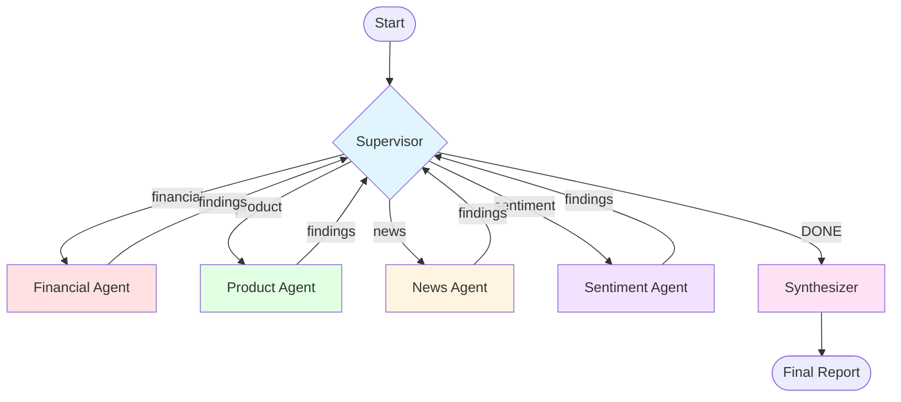

# Competitive Intelligence Analyzer

An advanced multi-agent workflow that orchestrates specialized research agents to generate comprehensive competitive
intelligence reports. This example demonstrates supervisor-agent patterns, dynamic agent routing, and collaborative
intelligence gathering.

## Overview

The Competitive Intelligence Analyzer uses a **supervisor pattern** to coordinate four specialized research agents
(Financial, Product, News, Sentiment), each contributing unique insights about a target company. The supervisor
dynamically decides which agents to call, in what order, and with what focus, based on the evolving research context.

**Key Achievement:** Demonstrates how to build autonomous multi-agent systems where a supervisor orchestrates
specialized agents to collaboratively solve complex research tasks.

## What You'll Learn

- **Supervisor-Agent Pattern**: Implementing intelligent orchestration with a supervisor node
- **Dynamic Agent Routing**: Conditional routing based on research context and priorities
- **Multi-Agent Collaboration**: Coordinating specialized agents that build on each other's findings
- **Two-Pass LLM Pattern**: Separating research (with tools) from structured extraction
- **Context-Aware Decision-Making**: Using accumulated findings to guide later research
- **Structured Report Synthesis**: Combining multi-agent findings into a cohesive output

## Use Cases

- Competitive analysis and market research
- Due diligence for investments or partnerships
- Market intelligence gathering
- Company profiling for sales/BD teams
- Automated research workflows with multiple perspectives

## Complexity

**Advanced** — Builds on concepts from both previous examples

## Pattern

Multi-agent orchestration with supervisor-driven dynamic routing

## Estimated Runtime

10–15 minutes for comprehensive analysis (varies based on agent calls, research depth, and compute resources)

## Running the Example

```bash
# Start the application
./gradlew bootRun

# Run with default company (Anthropic)
examples run CompetitiveIntelligenceAnalyzer

# Analyze a specific company
examples run CompetitiveIntelligenceAnalyzer "OpenAI"
```

## Architecture

### Workflow Diagram



### Agent Responsibilities

**Supervisor Agent:**

- Analyzes current research context (findings so far, agents called)
- Decides which agent to call next (or if research is complete)
- Provides research focus for the next agent
- Maintains reasoning trail for transparency
- Manages remaining agent call budget

**Financial Analysis Agent:**

- Revenue, funding, and financial performance
- Business model and monetization
- Growth metrics and profitability
- Recent funding rounds or financial events

**Product Analysis Agent:**

- Core product offerings and features
- Target market and customer segments
- Product differentiation and competitive advantages
- Technology stack and platform approach

**News/Developments Agent:**

- Recent company announcements
- Product launches and updates
- Partnerships and acquisitions
- Strategic initiatives and pivots

**Market Sentiment Agent:**

- Customer reviews and ratings
- Social media sentiment
- Industry analyst opinions
- Market perception and brand reputation

**Synthesizer Node:**

- Combines all agent findings
- Generates executive summary
- Organizes insights by category
- Preserves source citations
- Creates a final Markdown report

## State Management

### State Schema

```kotlin
class CompetitiveIntelligenceState(initData: Map<String, Any>) : AgentState(initData) {
    companion object {
        const val COMPANY_NAME_KEY = "company_name"
        const val REMAINING_AGENT_CALLS_KEY = "remaining_agent_calls"
        const val AGENT_FINDINGS_KEY = "agent_findings"
        const val AGENTS_CALLED_KEY = "agents_called"
        const val SUPERVISOR_REASONING_KEY = "supervisor_reasoning"
        const val NEXT_AGENT_KEY = "next_agent"
        const val RESEARCH_FOCUS_KEY = "research_focus"
        const val FINAL_REPORT_KEY = "final_report"

        val SCHEMA: Map<String, Channel<*>> = mapOf(
            COMPANY_NAME_KEY to Channels.base<String>({ _, o2 -> o2 }, { "" }),
            REMAINING_AGENT_CALLS_KEY to Channels.base<Int>({ _, o2 -> o2 }, { 10 }),
        )
    }
}
```

**Input Keys (defined in schema):**

- `company_name` - Target company to analyze
- `remaining_agent_calls` - Budget for agent calls (prevents infinite loops)

**Output Keys (use default "last write wins"):**

- `agent_findings` - Accumulated findings from all agents
- `agents_called` - List of agents called so far
- `supervisor_reasoning` - Reasoning trail from supervisor
- `next_agent` - Which agent to call next
- `research_focus` - Specific focus area for next agent
- `final_report` - Final synthesized report

### State Accumulation Pattern

**Manual List Accumulation:**

Unlike Research Report Writer which uses simple append, this example uses manual accumulation for better control:

```kotlin
// Supervisor accumulates reasoning and agents_called
val updatedReasoning = state.supervisorReasoning().toMutableList()
updatedReasoning.add(decision.reasoning)

val updatedAgentsCalled = state.agentsCalled().toMutableList()
updatedAgentsCalled.add(decision.nextAgent)

return mapOf(
    SUPERVISOR_REASONING_KEY to updatedReasoning,
    AGENTS_CALLED_KEY to updatedAgentsCalled,
)
```

**Why Manual Accumulation:**

- Explicit control over list operations
- Clear debugging (can log before/after)
- Type-safe mutations
- Easier to add validation or transformation logic

## Implementation Details

### Node Implementation

#### Supervisor Node

```kotlin
class SupervisorNode(
    private val intelligenceService: CompetitiveIntelligenceLlmService,
) : NodeAction<CompetitiveIntelligenceState> {
    override fun apply(state: CompetitiveIntelligenceState): Map<String, Any> {
        val company = state.companyName()
        val previousFindings = state.agentFindings()
        val calledAgents = state.agentsCalled()
        val remainingCalls = state.remainingAgentCalls()

        val decision = intelligenceService.decideSupervisor(
            company, previousFindings, calledAgents, remainingCalls
        )

        // Manually accumulate lists
        val updatedReasoning = state.supervisorReasoning().toMutableList()
        updatedReasoning.add(decision.reasoning)

        val updatedAgentsCalled = state.agentsCalled().toMutableList()
        updatedAgentsCalled.add(decision.nextAgent)

        val resultMap = mutableMapOf(
            NEXT_AGENT_KEY to decision.nextAgent,
            SUPERVISOR_REASONING_KEY to updatedReasoning,
            AGENTS_CALLED_KEY to updatedAgentsCalled,
        )

        if (decision.researchFocus != null) {
            resultMap[RESEARCH_FOCUS_KEY] = decision.researchFocus
        }

        return resultMap
    }
}
```

**Key Pattern:** Thin wrapper that extracts state, calls service, returns state updates.

#### Research Agent Node (Example: Financial)

```kotlin
class FinancialAgent(
    private val intelligenceService: CompetitiveIntelligenceLlmService,
) : NodeAction<CompetitiveIntelligenceState> {
    override fun apply(state: CompetitiveIntelligenceState): Map<String, Any> {
        val company = state.companyName()
        val previousFindings = state.agentFindings()
        val researchFocus = state.researchFocus()

        val agentFindings = intelligenceService.conductFinancialResearch(
            company, previousFindings, researchFocus
        )

        val updatedFindings = state.agentFindings().toMutableList()
        updatedFindings.add(agentFindings)
        val remainingCalls = state.remainingAgentCalls() - 1

        return mapOf(
            AGENT_FINDINGS_KEY to updatedFindings,
            REMAINING_AGENT_CALLS_KEY to remainingCalls,
        )
    }
}
```

**Key Pattern:** Each agent is identical except for which service method they call. Clean separation of concerns.

### Two-Pass LLM Pattern

This example demonstrates a sophisticated **two-pass pattern** for research agents:

**Pass 1: Research with Tools**

```kotlin
val researchPrompt = """
    Research the following topic: ${section.title}

    Use available tools to gather information.
    Write your findings in natural language with citations.

    At the end, include: TOOL_USAGE: YES or TOOL_USAGE: NO
"""

val result = chatModel.call(
    Prompt(UserMessage(researchPrompt),
    OllamaOptions.builder()
        .toolCallbacks(tools)
        .numPredict(32768)
        .build())
)
```

**Pass 2: Structured Extraction**

```kotlin
val extractionPrompt = """
    Extract structured findings from this research:

    $researchResult

    Output JSON:
    {
      "findings": [{"finding": "...", "source": "..."}],
      "confidence": "high|medium|low",
      "dataAvailability": "comprehensive|limited|sparse",
      "usedTools": true|false
    }
"""

val extraction = chatModel.call(
    Prompt(
        UserMessage(extractionPrompt),
        OllamaOptions.builder()
            .format(converter.jsonSchemaMap)
            .build()
    )
)
```

**Why Two Passes:**

1. **Tool calling + structured JSON is unreliable** — LLMs struggle to use tools AND generate perfect JSON in one pass
2. **Natural language research is easier** — LLMs perform better when writing freeform text with citations
3. **Extraction is simpler** — Converting text to JSON is easier than generating both simultaneously
4. **Quality check** — Can verify tool usage before accepting findings
5. **Graceful degradation** — If tool calling fails, still get text-based findings

**Trade-off:** Extra LLM call (~2–3 seconds) for significantly higher reliability.

### Service Extraction Architecture

This example demonstrates the **service extraction pattern** for testability:

**CompetitiveIntelligenceLlmService:**

- All business logic (LLM calls, prompting, parsing)
- No graph or state management
- Fully unit testable with mocked LLMs

**CompetitiveIntelligenceGraphService:**

- Graph construction and wiring
- Node definitions as thin wrappers
- State management orchestration
- Tested via node unit tests

**Benefits:**

- LLM service has 17 comprehensive unit tests
- Graph service has 11 node orchestration tests
- Clean separation: business logic vs. orchestration
- Easy-to-mock service for graph tests

See [Testing Architecture](../../architecture/testing.md) for full pattern details.

## Design Decisions

### 1. Supervisor vs Fixed Sequence

**Decision:** Use supervisor to dynamically route agents

**Rationale:**

- Different companies need different research priorities
- Supervisor can adapt based on data availability
- Can skip agents if information is already gathered
- Provides research reasoning trail for transparency

**Alternative Considered:** Fixed sequence (Financial → Product → News → Sentiment)

**Trade-off:** More LLM calls (supervisor decisions) but higher quality research

### 2. Remaining Calls Budget

**Decision:** Hard limit of 10 agent calls to prevent infinite loops

**Rationale:**

- Supervisor LLM could theoretically loop forever
- Need circuit breaker for production reliability
- Ten calls allow multiple passes (four agents × two rounds + synthesis)

**Configured in:** Initial state setup

```kotlin
val initialState = mapOf(
    COMPANY_NAME_KEY to companyName,
    REMAINING_AGENT_CALLS_KEY to 10,
)
```

### 3. Two-Pass Research Pattern

**Decision:** Separate research (with tools) from extraction (JSON)

**Why:**

- Tool calling and structured output in one pass: Less reliable with complex JSON schemas
- Two-pass pattern: Significantly more reliable, separates concerns
- An extra 2–3 seconds per agent is acceptable for improved reliability

**When Not to Use:**

- Real-time applications (latency-critical)
- Simple extractions (tool calling not needed)
- High token costs (extra LLM call)

### 4. Context-Aware Research Focus

**Decision:** Supervisor provides specific research focus to agents

**Example:**

```
Supervisor sees financial findings show "$100M Series B raised in 2023"
Next decision: "Call product agent, focus on: Recent product updates since Series B funding"
```

**Benefits:**

- Agents know what gaps to fill
- Prevents redundant research
- Builds a coherent narrative
- Maximizes information value per agent call

### 5. Manual vs Automatic List Accumulation

**Decision:** Manually accumulate lists in nodes rather than using append channels

**Code Pattern:**

```kotlin
// Manual accumulation
val updatedFindings = state.agentFindings().toMutableList()
updatedFindings.add(newFinding)
return mapOf(AGENT_FINDINGS_KEY to updatedFindings)

// vs. Automatic (if we had used an append-channel)
// return mapOf(AGENT_FINDINGS_KEY to listOf(newFinding))
```

**Why Manual:**

- Explicit control over list operations
- Easier debugging (can log intermediate state)
- More obvious what's happening
- Simpler schema (no need to configure append reducer)

**When Automatic is Better:**

- Parallel nodes writing to the same list
- Complex merge logic is needed
- Multiple sources append concurrently

## Key Implementation Patterns

### 1. Conditional Routing for Supervisor

```kotlin
val supervisorCondition = AsyncEdgeAction<CompetitiveIntelligenceState> { state ->
    val nextAgent = state.nextAgent() ?: "DONE"
    val destination = when (nextAgent) {
        "financial" -> "financial"
        "product" -> "product"
        "news" -> "news"
        "sentiment" -> "sentiment"
        "DONE" -> "done"
        else -> {
            log.warn("Unknown agent: $nextAgent, routing to done")
            "done"
        }
    }
    CompletableFuture.completedFuture(destination)
}

val supervisorMappings = mutableMapOf(
    "financial" to "financial_agent",
    "product" to "product_agent",
    "news" to "news_agent",
    "sentiment" to "sentiment_agent",
    "done" to "synthesizer",
)
```

**Pattern:** Edge condition extracts `nextAgent` from state, maps to node name.

### 2. Shared Agent Structure

All research agents follow an identical structure:

1. Extract: `company`, `previousFindings`, `researchFocus` from state
2. Call: `intelligenceService.conduct[Agent]Research(...)`
3. Accumulate: Add findings to list, decrement remaining calls
4. Return: Updated state with new findings

**Benefits:**

- Quickly add new agents (copy-paste template, can extract common logic in the future)
- Consistent behavior and error handling
- Straightforward to add tests (the same pattern for all tests)

### 3. Tool Usage Validation

```kotlin
if (!extraction.usedTools) {
    log.warn("Agent did not use tools, skipping findings")
    return null
}
```

**Purpose:** Ensure agents actually searched for information rather than hallucinating.

**Impact:** Increases report quality by rejecting non-researched findings.

## Quantitative Results

### Performance Metrics

**Execution Time:** 3–5 minutes for typical company analysis

**Breakdown:**

- Supervisor decisions: 10–15 s each × ~4 calls = 40–60 s
- Agent research: 30–60 s each × 4 agents = 2–4 minutes
- Synthesis: 20–30 s
- Overhead: ~10–15 s (state management, logging)

**Agent Call Pattern:**

- Initial cycle: All 4 agents gather baseline intelligence
- Later cycles: Supervisor calls 1–2 agents for focused follow-up
- Final cycle: Optional targeted calls for specific gaps

## Lessons Learned

### 1. Two-Pass Pattern is Worth It

**Problem:** Initial single-pass implementation struggled with structured extraction when combining tool calls and
complex JSON schemas.

**Solution:** Split into research pass (natural language) + extraction pass (JSON).

**Result:** Significantly improved reliability, worth the extra LLM call.

### 2. Simpler Budget Instructions Work Better

**Problem:** When budget instructions were too explicit and detailed, the LLM made mistakes with budget counting and
only used about half of its allocated 10 agent calls.

**Solution:** Simplified the budget management instructions, making them easier for the LLM to understand.

**Impact:** The supervisor now consistently uses all 10 calls in its budget, allowing for more comprehensive research
coverage.

### 3. Budget Limits Prevent Runaways

**Problem:** In early testing, the supervisor entered an infinite loop, repeatedly asking the same agent for the same
information until LangGraph4j hit its maximum recursion limit (25 nodes).

**Solution:** Implemented a hard limit on total agent calls (`REMAINING_AGENT_CALLS`) to serve as a circuit breaker.

**Best Practice:** Always have circuit breakers in agentic workflows to prevent runaway behavior.

### 4. Research Focus Dramatically Improves Quality

**Problem:** Without focus, agents sometimes duplicated research or missed context.

**Solution:** Supervisor provides specific research focus per agent call.

**Example:**

```
Without focus: "Research their product"
With focus: "Research product updates since their $50M Series B in Q2 2023"
```

**Impact:** More targeted, less redundant research.

### 5. Manual Accumulation Improves Observability

**Design Choice:** Used explicit `.toMutableList()` + `.add()` pattern from the beginning instead of append channels.

**Benefits:**
- Can log before/after state changes
- Easier to add validation logic
- A clear flow of data makes debugging straightforward
- Cumulative results help supervisor make better decisions by seeing full research context

**Trade-off:** More verbose code, but the improved observability and supervisor decision quality made it worthwhile.

### 6. Specialized MCP Servers for Domain-Specific Data

**Problem:** The financial agent produces significantly more hallucinations compared to other agents, inventing revenue
figures, funding rounds, and financial metrics that don't exist.

**Root Cause:** Generalized search tools like Brave Search MCP server work well for general research but struggle with
structured financial data. LLMs are prone to hallucinating specific numbers when search results are vague or incomplete.

**Better Approach:** Use specialized MCP servers for domain-specific data:

**For Public Companies:**

- [Alpha Vantage MCP Server](https://github.com/alphavantage/alpha_vantage_mcp)
- [Financial Datasets MCP Server](https://github.com/financial-datasets/mcp-server)
- [EODHD MCP Server](https://github.com/Enlavan/EODHD_MCP_server)

**For Private Companies:**

- Generalized search may be the only option
- Could implement stricter validation (e.g., require multiple corroborating sources)
- Mark findings as "unverified" when only found via search

**Key Insight:** Match tool specificity to data criticality. Financial data requires high accuracy, so specialized tools
with specialized outputs are worth the integration effort. General search works fine for qualitative insights (product
news, sentiment).

**Status:** Not yet implemented, but identified as a priority improvement for production use.

## Testing Strategy

This example follows the service extraction pattern with comprehensive unit tests across two test suites:

**CompetitiveIntelligenceLlmServiceTest:**

Tests all business logic methods including context building, two-pass extraction, supervisor decision-making, agent
research methods, and report synthesis.

**CompetitiveIntelligenceGraphServiceTest:**

Tests all graph orchestration including supervisor node routing, agent node state management, synthesizer node, and
state accessor methods.

See [Testing Architecture](../../architecture/testing.md) for full testing patterns and examples.

## Source Code

**Main Implementation:**

- `CompetitiveIntelligenceGraphService.kt` - Graph orchestration (285 lines)
- `CompetitiveIntelligenceLlmService.kt` - Business logic (722 lines)
- `CompetitiveIntelligenceAnalyzer.kt` - Command interface

**Tests:**

- `CompetitiveIntelligenceLlmServiceTest.kt` - Service unit tests
- `CompetitiveIntelligenceGraphServiceTest.kt` - Graph node tests

## Next Steps

### Extending This Example

**Add New Research Agent:**

1. Create a new agent node class (copy existing agent structure)
2. Implement service method in `CompetitiveIntelligenceLlmService`
3. Add to supervisor routing logic
4. Update supervisor prompt to include a new agent

**Customize Research Prompts:**

- Edit agent prompts in `CompetitiveIntelligenceLlmService`
- Adjust research questions and focus areas
- Modify the structured output schema

**Adjust Agent Budget:**

- Change `REMAINING_AGENT_CALLS_KEY` initial value
- Higher values: More thorough research
- Lower values: Faster execution

### Building Similar Workflows

This pattern works well for:

- **Due diligence research** — Financial, legal, technical agents
- **Market analysis** — Industry trends, competitors, opportunities
- **Content creation** — Research, outlining, writing, editing agents
- **Problem diagnosis** — Different diagnostic perspectives collaborating

**Key Insight:** When a task needs multiple specialized perspectives, a supervisor-agent pattern provides coordinated,
adaptive orchestration.

## Related Examples

- **[Research Report Writer](../research-report-writer/index.md)** — Similar tool calling, simpler routing
- **[House PTR Parser](../house-ptr-parser/index.md)** — Linear workflow foundation

## See Also

- [Architecture Overview](../../architecture.md) — Multi-agent patterns
- [Testing Architecture](../../architecture/testing.md) — Service extraction pattern
- [Configuration Guide](../../development/configuration.md) — Model and token setup
