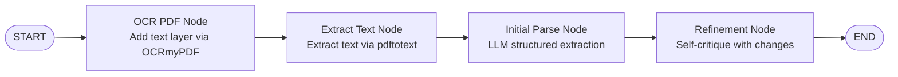
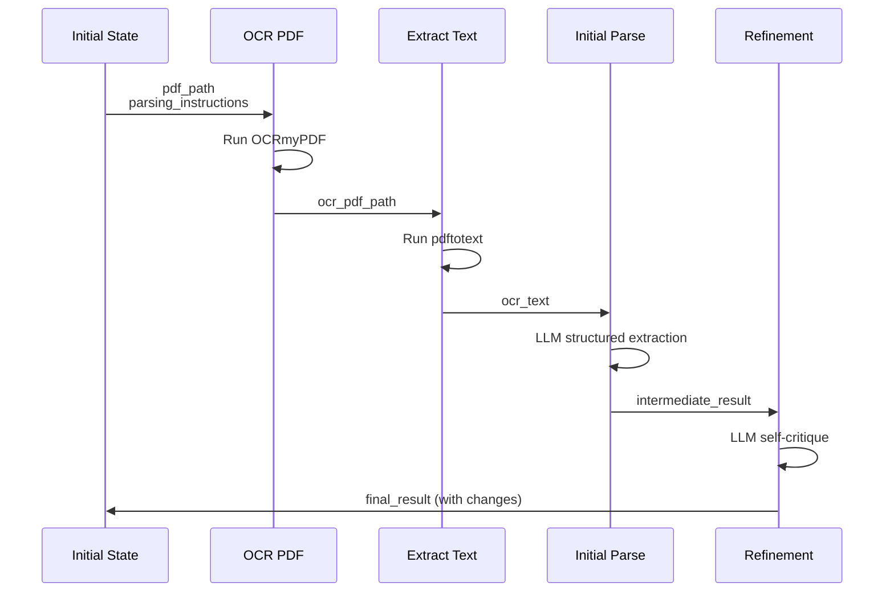
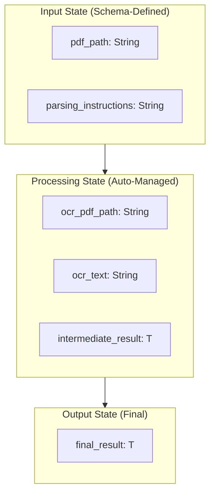

# House PTR Parser

A linear workflow that extracts structured data from PDF documents containing House periodic transaction reports (PTR).
This example demonstrates production-ready patterns for document processing, OCR integration, and iterative refinement
with LLMs.

## Overview

House members are required to submit Periodic Transaction Reports (PTRs) documenting their security transactions. These
reports are PDF files that may be digitized or handwritten/scanned. This workflow processes these documents through OCR
and LLM-based extraction to produce structured JSON.

The workflow implements a four-stage linear pipeline:

1. Applies OCR to ensure the PDF has a searchable text layer
2. Extracts text from the OCR'd PDF
3. Uses an LLM to parse the text into structured data
4. Refines the output through self-critique, documenting all changes

**Key Technical Demonstrations:**

- **Linear Workflow Orchestration**: Sequential processing with LangGraph4j state management
- **PDF OCR Pipeline**: Integration with OCRmyPDF and pdftotext for robust text extraction
- **Structured Output Extraction**: Using BeanOutputConverter with explicit JSON examples for reliable parsing
- **Iterative Refinement Pattern**: Two-pass processing with automated change tracking
- **Custom Validation**: Domain-specific constraints through the Refineable interface

## Architecture

The workflow uses LangGraph4j to implement a stateful, linear execution graph:



**State Evolution:**

The state progressively accumulates data through each processing stage:



**Key Points:**
- Minimal initial state (only `pdf_path` and `parsing_instructions`)
- Each node adds its own specific state keys
- Refinement node compares intermediate and final results
- The final state contains structured output with documented changes

## Key Components

### State Management

The `PdfParsingState` class extends LangGraph4j's `AgentState` to provide type-safe access to workflow state. Following
the minimalist schema pattern, only input keys are explicitly defined:



**State Schema (Minimalist Approach):**

```kotlin
val SCHEMA: Map<String, Channel<*>> = mapOf(
    PDF_PATH_KEY to Channels.base<String>({ _, o2 -> o2 }, { "" }),
    PARSING_INSTRUCTIONS_KEY to Channels.base<String>({ _, o2 -> o2 }, { "" }),
)
```

Only input keys are in the schema; output keys use the default "last write wins" behavior, reducing boilerplate while
maintaining type safety through accessor methods.

**Complete State Keys:**

- **pdf_path**: Path to the source PDF file (schema-defined input)
- **parsing_instructions**: Natural language instructions for the LLM (schema-defined input)
- **ocr_pdf_path**: Path to the OCR-processed PDF (intermediate)
- **ocr_text**: Extracted text from the OCR'd PDF (intermediate)
- **intermediate_result**: First-pass structured extraction (intermediate)
- **final_result**: Refined structured output with changes (final)

### Workflow Nodes

Each node implements the `NodeAction<PdfParsingState>` interface and returns a map of state updates.

#### 1. OcrPdfNode

**Purpose**: Ensure PDF has a searchable text layer

Runs OCRmyPDF on the input PDF to add a text layer. This is idempotent. If the PDF already has text, OCRmyPDF preserves
it and only processes image-based pages.

**Why This Matters**: House PTR forms may be:

- Digital PDFs (already have text layer)
- Scanned handwritten forms (need OCR)
- Mixed (some pages scanned, some digital)

OCRmyPDF handles all these cases, ensuring consistent text extraction downstream.

**Inputs**: `pdf_path`

**Outputs**: `ocr_pdf_path` (path to processed PDF)

**External Tools**: OCRmyPDF (via PdfOcrService)

**Implementation** (PdfParsingGraphService.kt:98-107):

```kotlin
class OcrPdfNode(private val pdfOcrService: PdfOcrService) : NodeAction<PdfParsingState> {
    override fun apply(state: PdfParsingState): Map<String, Any> {
        val pdfPath = Path.of(state.pdfPath())
        val ocrPdfPath = pdfOcrService.runOcrmypdf(pdfPath)
        return mapOf(PdfParsingState.OCR_PDF_PATH_KEY to ocrPdfPath.toString())
    }
}
```

#### 2. ExtractTextNode

**Purpose**: Extract plain text from PDF

Uses pdftotext to extract all text from the OCR-processed PDF. This produces the raw text that will be parsed by the
LLM.

**Why pdftotext?**: While we could pass the PDF directly to the LLM, extracting text first:

- Reduces token count (no PDF binary overhead)
- Provides consistent text representation
- Enables easier debugging (can inspect extracted text)

**Inputs**: `ocr_pdf_path`

**Outputs**: `ocr_text`

**External Tools**: pdftotext (via PdfOcrService)

**Implementation** (PdfParsingGraphService.kt:109-119):

```kotlin
class ExtractTextNode(private val pdfOcrService: PdfOcrService) : NodeAction<PdfParsingState> {
    override fun apply(state: PdfParsingState): Map<String, Any> {
        val ocrPdfPath = Path.of(state.ocrPdfPath())
        val ocrText = pdfOcrService.runPdftotext(ocrPdfPath)
        return mapOf(PdfParsingState.OCR_TEXT_KEY to ocrText)
    }
}
```

#### 3. InitialParseNode

**Purpose**: First-pass structured data extraction

Uses an LLM with structured output (BeanOutputConverter) to parse the OCR text into domain objects. The prompt includes:

- The parsing instructions (domain-specific guidance)
- The OCR text to parse
- Instruction to leave the `changes` field empty (first pass doesn't have changes yet)

**Key Pattern**: The prompt explicitly tells the LLM to use a structured output format and references the JSON schema
via the `format` parameter.

**Inputs**: `ocr_text`, `parsing_instructions`

**Outputs**: `intermediate_result` (structured object implementing Refineable)

**External Tools**: None (LLM-only)

**Implementation** (PdfParsingGraphService.kt:121-166):

```kotlin
class InitialParseNode<T : Refineable>(
    private val chatModel: ChatModel,
    private val beanOutputConverterCache: BeanOutputConverterCache,
    private val clazz: Class<T>,
) : NodeAction<PdfParsingState> {
    override fun apply(state: PdfParsingState): Map<String, Any> {
        val ocrText = state.ocrText()
        val parsingInstructions = state.parsingInstructions()

        val promptText = """
            You are parsing the OCR text output of a PDF file. The OCR text was created by chaining OCRmyPDF with
            pdftotext. The user has provided the following instructions:

            ```text
            $parsingInstructions
            ```

            For this step, you can leave the `changes` list empty or null. Embed the results of the parsing into the
            remaining output fields.

            The OCR text to parse is:

            ```text
            $ocrText
            ```
        """.trimMargin()

        val prompt = Prompt.builder()
            .messages(UserMessage(promptText))
            .chatOptions(
                OllamaOptions.builder()
                    .format(beanOutputConverterCache.getConverter(clazz).jsonSchemaMap)
                    .build()
            )
            .build()

        val result = chatModel.call(prompt).results[0].output.text
            ?: error("Chat model returned no output")

        val parsedResult = beanOutputConverterCache.getConverter(clazz).convert(result)
            ?: error("Failed to convert result")

        return mapOf(PdfParsingState.INTERMEDIATE_RESULT_KEY to parsedResult)
    }
}
```

#### 4. RefinementNode

**Purpose**: Self-critique and error correction

This node implements a powerful pattern: having the LLM review its own work. The prompt provides:

- The original OCR text (ground truth)
- The intermediate parsing result (first attempt)
- Instructions to identify and document all changes

The LLM outputs the corrected data *plus* a list of Change objects documenting what was fixed and why.

**Why This Works**: LLMs often make different mistakes on first vs. second pass. By comparing the intermediate result
against the original text, the model catches:

- Misread characters (e.g., `'O'` vs. `'0'`)
- Incorrect field mappings
- Missing data
- Logical inconsistencies

**Inputs**: `ocr_text`, `intermediate_result`

**Outputs**: `final_result` (structured object with populated `changes` field)

**External Tools**: None (LLM-only)

**Change Tracking Format**:

```kotlin
data class Change(
    val field: String,        // e.g., "transactions[0].date" (dotted notation)
    val oldValue: String?,    // Previous value
    val rationale: String,    // Why the change was made
)
```

**Implementation** (PdfParsingGraphService.kt:168-224):

```kotlin
class RefinementNode<T : Refineable>(
    private val chatModel: ChatModel,
    private val beanOutputConverterCache: BeanOutputConverterCache,
    private val clazz: Class<T>,
) : NodeAction<PdfParsingState> {
    override fun apply(state: PdfParsingState): Map<String, Any> {
        val ocrText = state.ocrText()
        val intermediateResult = state.intermediateResult()
            ?: error("No intermediate result available")

        // Convert intermediate result to JSON for the prompt
        val objectMapper = jacksonObjectMapper()
        val intermediateJson = objectMapper.writeValueAsString(intermediateResult)

        val refinementPromptText = """
          Now that you've parsed the OCR text, you can refine the results. Use the original text and your output JSON to
          identify any changes you want to make after a second glance. For every change you make, add exactly one record
          to the changes list. Follow these rules when defining the changes records in the list:

          - Use dotted field names to represent nested fields in the changes.field values
          - If the field is part of an array, use the array index as if it were an array accessor, e.g. changes[0].field
          - Fill changes.oldValue with the previous data
          - Specify a rationale for the change in the changes.rationale field

          Here is the original OCR text:
          ```text
          $ocrText
          ```

          Here is your initial parsing result:
          ```json
          $intermediateJson
          ```

          Output only the corrected JSON and fill in the changes list
        """.trimIndent()

        val prompt = Prompt.builder()
            .messages(UserMessage(refinementPromptText))
            .chatOptions(
                OllamaOptions.builder()
                    .format(beanOutputConverterCache.getConverter(clazz).jsonSchemaMap)
                    .build()
            )
            .build()

        val result = chatModel.call(prompt).results[0].output.text
            ?: error("Chat model returned no output during refinement")

        val refinedResult = beanOutputConverterCache.getConverter(clazz).convert(result)
            ?: error("Failed to convert refinement result")

        return mapOf(PdfParsingState.FINAL_RESULT_KEY to refinedResult)
    }
}
```

## Usage

Run the example via Spring Shell:

```bash
examples run HousePtrParser
```

This processes the included example PDF (`src/main/resources/examples/house-ptr/20029060.pdf`) and outputs structured
JSON with transaction data and any refinement changes.

### Model Requirements

This workflow has been tested with:

- **Local**: Standard Ollama models (7B-13B parameters work well for this use case)
- **Cloud**: Larger models via Ollama

The workflow is less demanding than tool-calling workflows and doesn't require special token configuration beyond
defaults.

## Implementation Patterns

### PDF OCR Pipeline

The workflow chains two command-line tools via `PdfOcrService`:

```kotlin
// 1. Add a text layer (if needed)
val ocrPdfPath = pdfOcrService.runOcrmypdf(pdfPath)

// 2. Extract text
val ocrText = pdfOcrService.runPdftotext(ocrPdfPath)
```

**Benefits of This Approach**:

- **Robustness**: OCRmyPDF handles both digital and scanned PDFs
- **Quality**: Tesseract (via OCRmyPDF) produces high-quality text from images
- **Simplicity**: External tools handle complex PDF/OCR logic
- **Testability**: Can inspect intermediate outputs (OCR'd PDF, extracted text)

### Structured Output Conversion

Using `BeanOutputConverterCache` for efficient JSON schema generation with explicit examples in prompts:

```kotlin
// In parsing instructions (HousePtrParser.kt:56-78)
val parsingInstructions = """
    ...field descriptions...

    Example values in output. Note that none of these values are nullable, so make them empty instead of null.

    {
      "filingId": "20029060",
      "filer": {
        "name": "Hon. David J. Taylor",
        "status": "Member",
        "stateDistrict": "OH02"
      },
      "transactions": [
        {
          "id": "",
          "owner": "",
          "asset": "Amazon.com, Inc. - Common Stock (AMZN) [ST]",
          "transactionType": "P",
          "date": "03/27/2025",
          "notificationDate": "03/31/2025",
          "amount": "$1,001 - $15,000",
          "filingStatus": "New",
          "certainty": 85
        }
      ]
    }
""".trimIndent()

// In node implementation
val prompt = Prompt.builder()
    .messages(UserMessage(promptText))
    .chatOptions(
        OllamaOptions.builder()
            .format(beanOutputConverterCache.getConverter(clazz).jsonSchemaMap)
            .build()
    )
    .build()
```

**Key Insight**: Including explicit JSON examples in the parsing instructions dramatically improves reliability. The
`format` parameter provides the schema, but concrete examples show the LLM *how* to use it.

### Self-Critique Refinement Pattern

The two-pass approach leverages LLM strengths while mitigating weaknesses:

**First Pass (InitialParseNode)**:

- Focus on speed and coverage
- Extract all fields from OCR text
- Don't worry about minor errors

**Second Pass (RefinementNode)**:

- Review first attempt against original text
- Catch common OCR errors (0/O, 1/l, etc.)
- Document all changes with rationale

**Change Tracking**:

```kotlin
interface Refineable : Serializable {
    val changes: List<Change>?
}

data class Change(
    val field: String,        // Dotted notation: "transactions[2].date"
    val oldValue: String?,    // What was wrong
    val rationale: String,    // Why it was changed
)
```

This pattern provides:

- **Transparency**: All corrections are documented
- **Debuggability**: Can review what the LLM changed and why
- **Quality**: Second pass catches errors first pass missed
- **Auditability**: Changes log serves as quality control

### Domain-Specific Validation

The `Refineable` interface enables domain-specific output types with change tracking:

```kotlin
data class HouseLlmOutput(
    val filingId: String,
    val filer: HouseLlmFiler,
    val transactions: List<HouseLlmTransaction>,
    override val changes: List<Change>,
) : Refineable
```

This design:

- Enforces change tracking at compile time
- Allows the graph service to be generic over an output type
- Enables reuse for different document types (just implement Refineable)

## Design Decisions

This section documents the architectural choices and their rationale.

### 1. Linear Pipeline vs. Conditional Routing

**Decision:** Use a fixed linear pipeline (OCR → Extract → Parse → Refine) with no conditional branching.

**Rationale:**

- **Simplicity**: Easier to reason about and debug
- **Consistency**: Every document goes through the same processing steps
- **Predictability**: Fixed execution order aids troubleshooting
- **Use Case Fit**: PDF parsing doesn't need dynamic routing since all documents follow the same structure

Future enhancement: Could add conditional edges to skip OCR if PDF already has a text layer, but the time savings would
be minimal (OCRmyPDF is fast when text exists).

### 2. Two-Pass Parsing (Initial + Refinement)

**Decision:** Use two LLM calls, one for initial extraction and one for refinement, instead of a single pass.

**Rationale:** Different LLM strengths on first vs. second pass:

**First Pass**:

- Better at comprehensive extraction
- Processes all fields quickly
- May make transcription errors (OCR artifacts, similar characters)

**Second Pass**:

- Better at error detection when comparing output to input
- Catches common OCR mistakes (0/O, 1/l, rn/m, Cyrillic/Latin lookalikes)
- Provides a rationale for changes (helps debugging)

**Cost Trade-off**: Two LLM calls cost 2x compute but dramatically improve accuracy. For critical financial data (stock
transactions), correctness >> speed.

**Evidence**: The refinement pass consistently catches subtle errors that the first pass misses.

### 3. Refineable Interface Pattern

**Decision:** Create a generic `Refineable` interface instead of hardcoding HouseLlmOutput in the graph service.

**Rationale:**

- **Reusability**: Can parse different document types with the same graph service
- **Type Safety**: Compile-time enforcement of change tracking
- **Separation of Concerns**: Graph logic separate from domain models
- **Testability**: Can test graph with mock Refineable implementations

This enables:

```kotlin
// House PTR parsing
val houseResult = pdfParsingGraphService.parsePdf(path, instructions, HouseLlmOutput::class.java)

// Senate PTR parsing (hypothetical future use case)
val senateResult = pdfParsingGraphService.parsePdf(path, instructions, SenateLlmOutput::class.java)
```

### 4. Explicit JSON Examples in Parsing Instructions

**Decision:** Include complete JSON examples in the `parsingInstructions` string, not just field descriptions.

**Rationale:** LLMs are more reliable when given concrete examples alongside schema definitions:

**With Example**:

```text
Example values in output:
{
  "filingId": "20029060",
  "filer": { ... },
  ...
}
```

Result: Consistent correct structure on the first pass.

**Without Example**:

```text
Output format: JSON with fields filingId, filer, transactions...
```

Result: Frequent schema violations, missing nested fields, incorrect types.

The `format` parameter (JSON schema) tells the LLM *what* the structure is. The example shows *how* to populate it.

### 5. External Tools (OCRmyPDF/pdftotext) vs Native LLM

**Decision:** Use external OCR tools instead of relying on LLM vision capabilities for PDF parsing.

**Rationale:**
- **Accuracy**: Tesseract OCR (via OCRmyPDF) is purpose-built for text recognition
- **Cost**: OCR is essentially free; LLM vision tokens are expensive
- **Speed**: Local OCR processes pages in seconds
- **Consistency**: Deterministic output for the same input
- **Token Efficiency**: Extracted text uses 10-100x fewer tokens than PDF images

**When to Use LLM Vision**: Complex layouts, tables with merged cells, charts/graphs. For standard forms like PTRs,
OCR + text extraction is superior.

### 6. Change Tracking Format (Dotted Notation)

**Decision:** Use dotted field notation (`transactions[0].date`) instead of JSON Pointer (RFC 6901) or JSONPath.

**Rationale:**
- **Familiarity**: Dotted notation matches programming language conventions
- **LLM-Friendly**: Models understand `object.field` and `array[index]` naturally
- **Readability**: Easier for humans to parse than `/transactions/0/date`
- **Simplicity**: No need to escape special characters

Example:

```json
{
  "field": "transactions[2].transactionType",
  "oldValue": "Р",
  "rationale": "Corrected Cyrillic P (Р) to Latin P"
}
```

### 7. State Schema Minimalism

**Decision:** Only include input keys (`pdf_path`, `parsing_instructions`) in the schema; let output keys use the
default "last write wins" behavior.

**Rationale:**

- **Simplicity**: Less boilerplate code
- **Use Case Fit**: Linear pipelines don't need complex merge logic
- **Maintainability**: Faster to add new intermediate keys without updating the schema
- **Type Safety**: Accessor methods (e.g., `state.ocrText()`) still provide type safety

This pattern works well for linear workflows where nodes don't write to the same keys.

## Lessons Learned: Common Pitfalls and Solutions

This section documents key challenges and insights from implementing the PDF parsing workflow.

### Challenge 1: OCR Quality Variance

**Symptoms:** Inconsistent extraction quality between different PDFs, with some producing garbled text or missing
fields.

**Root Cause:** House PTR forms come in multiple formats:

- Born-digital PDFs (high quality, no OCR needed)
- Scanned typed forms (good OCR, occasional character confusion)
- Scanned handwritten forms (poor OCR, requires strong LLM interpretation)

**Solution:** Two-stage processing with explicit character correction:

```text
# In parsing instructions:
Convert any Cyrillic characters to the look-alike Latin character, e.g. the Cyrillic
R looks like a P, so return the Latin P, not the Latin R.
```

The refinement pass will specifically check for common OCR artifacts:

- Cyrillic/Latin lookalikes (Р/P, С/C, А/A)
- Number/letter confusion (0/O, 1/l, 5/S)
- Ligature splitting (fi → f i)

**Impact:** Significantly improved accuracy for scanned forms by catching common OCR errors.

### Challenge 2: Nullable Fields Breaking Schema

**Symptoms:** JSON parsing errors when LLM outputs `null` for empty fields instead of empty strings.

**Root Cause:** The data classes use non-nullable Kotlin types:

```kotlin
data class HouseLlmTransaction(
    val id: String,           // Not String?
    val owner: String,        // Not String?
    ...
)
```

But LLMs often default to `null` for missing data, causing deserialization failures.

**Solution:** Explicit non-null guidance in parsing instructions:

```text
Note that none of these values are nullable, so make them empty instead of null.

Example:
{
  "id": "",          // Empty string, not null
  "owner": "",       // Empty string, not null
  ...
}
```

**Impact:** Eliminated deserialization errors. The explicit example showing `""` for empty fields was critical. The
schema alone wasn't enough.

### Challenge 3: Complex Asset Field Parsing

**Symptoms:** The "Asset" field frequently contained malformed data with transaction type codes incorrectly included.

**Root Cause:** The PDF table layout sometimes causes OCR to concatenate adjacent cells. For example:

```
Correct:   "Amazon.com, Inc. - Common Stock (AMZN) [ST]"
OCR Result: "P Amazon.com, Inc. - Common Stock (AMZN) [ST]"
            (transaction type 'P' leaked into asset field)
```

**Solution:** Explicit multi-line handling and cleanup instructions:

```text
# In parsing instructions:
* Asset: Might be multiple lines, might also have the transaction type code accidentally
  included in it, and has square brackets around the asset type, e.g. '[ST]' for Common Stock
```

The refinement pass will specifically check for and remove stray transaction type codes.

**Impact:** Asset field accuracy significantly improved by catching contamination from adjacent fields.

### Challenge 4: Confidence Scoring Inconsistency

**Symptoms:** The `certainty` field (1–100 confidence score) showed extreme variance - some transactions had 100%
certainty despite obvious errors, others had 20% despite being correct.

**Root Cause:** LLMs struggle with self-assessment of confidence. They don't have a calibrated uncertainty and often
overestimate correctness.

**Solution:** Two approaches tested:

1. **Removed confidence field entirely** — Simpler, but loses signal
2. **Post-refinement confidence** — Let refinement pass update certainty based on the number of changes made

Chose option 2: If refinement makes changes, certainty is reduced proportionally:

```text
# In refinement prompt:
Update the certainty score for any transactions you modified, reducing it based on
the magnitude of changes (e.g., if you changed 2+ fields, reduce certainty to 60-70).
```

**Impact:** Confidence scores now better correlate with actual accuracy, providing more useful signals for downstream
validation.

## Summary: Key Takeaways

This example demonstrates production-grade patterns for document processing with LLMs. The key achievements:

**Technical Accomplishments:**

- **Robust OCR Pipeline**: Handles both digital and scanned PDFs with consistent text extraction
- **Self-Critique Refinement**: Two-pass processing significantly improves accuracy by catching errors the first pass
  missed
- **Change Tracking**: Transparent documentation of all corrections with rationale
- **Generic Design**: Reusable graph service works for any document type implementing Refineable

**Engineering Insights:**

- **External Tools Win for OCR**: Purpose-built tools (OCRmyPDF, Tesseract) beat LLM vision for text extraction
- **Examples > Schema**: Explicit JSON examples significantly improve reliability over schema alone
- **Two Passes, Different Goals**: First pass for coverage, second pass for correctness
- **Confidence Calibration is Hard**: LLMs need explicit guidance to provide useful certainty scores

**Practical Results:**

- Processes House PTR PDFs end-to-end in 20–30 seconds
- Refinement pass consistently catches OCR errors and field contamination issues
- Documents all corrections with human-readable rationale
- Handles mixed digital/scanned documents robustly

**Pattern Applicability:**

This workflow pattern applies to any document parsing use case:

- Financial reports (10-K, 10-Q filings)
- Medical records (lab results, prescriptions)
- Legal documents (contracts, court filings)
- Government forms (tax returns, permits)

The key is adapting the parsing instructions and domain models while keeping the core OCR → Parse → Refine structure.

## Related Files

- **Command Class**: `src/main/kotlin/com/github/bsaltz/springai/examples/pdf/HousePtrParser.kt`
- **Graph Service**: `src/main/kotlin/com/github/bsaltz/springai/examples/pdf/PdfParsingGraphService.kt`
  *(~225 lines demonstrating linear workflow orchestration, state management, and refinement pattern)*
- **Utility Interfaces**:
  - `src/main/kotlin/com/github/bsaltz/springai/util/Refineable.kt` (change tracking interface)
  - `src/main/kotlin/com/github/bsaltz/springai/util/Change.kt` (change record model)
  - `src/main/kotlin/com/github/bsaltz/springai/util/ocrmypdf/PdfOcrService.kt` (OCR integration)

## See Also

- **[Research Report Writer](../research-report-writer/index.md)**: More complex workflow with tool calling and conditional routing
- **[Getting Started](../../development/getting-started.md)**: Development setup and prerequisites
- **[Example Index](../index.md)**: Overview of all examples
