# Example Overview

This directory contains production-grade examples demonstrating agentic workflow patterns using Spring AI and
LangGraph4j. Each example is fully functional, well-documented, and includes detailed architectural decisions and
debugging insights.

The examples are ordered by complexity, designed to build on each other's concepts.

## Available Examples

### 1. [House PTR Parser](house-ptr-parser/index.md)

A linear workflow that extracts structured data from PDF documents containing House stock transaction reports (PTR).

**What You'll Learn:**

- Linear workflow orchestration with LangGraph4j
- PDF OCR processing and text extraction
- Structured data extraction using LLMs and BeanOutputConverter
- Iterative refinement patterns for improving data quality
- Custom validation logic for domain-specific constraints

**Use Cases:** Document processing, data extraction from PDFs, form parsing

**Complexity:** Beginner

**Pattern:** Linear pipeline with iterative refinement

**Estimated Runtime:** 30–60 seconds per document

### 2. [Research Report Writer](research-report-writer/index.md)

An autonomous workflow that generates comprehensive, well-sourced research reports by orchestrating web search tools and
LLM reasoning.

**What You'll Learn:**

- **Tool Calling**: MCP integration with Spring AI's ToolCallback system (brave_web_search)
- **Prompt Engineering**: Explicit parameter guidance for reliable tool calling with local models
- **Conditional Routing**: Dynamic workflow paths based on validation and iteration state
- **Loop-Based Execution**: Iterative research across multiple sections
- **Token Management**: Proper `num-ctx`/`numPredict` configuration for tool calling
- **Error Handling**: Graceful degradation patterns for production reliability
- **Debugging Skills**: Real-world problem-solving (null vs undefined, token truncation, etc.)

**Key Achievement:** Reliable tool calling with local 20B models through careful configuration and prompting.

**Use Cases:** Autonomous research, content generation, market analysis, competitive intelligence

**Complexity:** Intermediate

**Pattern:** Conditional routing with loops and external tool integration

**Estimated Runtime:** 3–5 minutes for a 4-section report

### 3. [Competitive Intelligence Analyzer](competitive-intelligence/index.md)

A multi-agent system that autonomously researches companies by coordinating specialized agents (financial, product,
news, sentiment) through an intelligent supervisor.

**What You'll Learn:**

- **Supervisor-Agent Pattern**: Dynamic multi-agent orchestration with intelligent routing
- **Two-Pass LLM Pattern**: Separate research and structured extraction passes
- **Manual List Accumulation**: Explicit state list management vs automatic append channels
- **Conditional Agent Selection**: Context-aware routing based on previous findings
- **Multi-Agent Coordination**: Parallel specialization with a shared state
- **Complex State Management**: Managing supervisor reasoning, agent findings, and routing state
- **Production Debugging**: Real-world challenges with list accumulation and state management

**Key Achievement:** Autonomous multi-agent system that adapts research strategy based on discovered information.

**Use Cases:** Competitive analysis, market research, due diligence, investment research

**Complexity:** Advanced

**Pattern:** Supervisor-agent architecture with dynamic multi-agent orchestration

**Estimated Runtime:** 10–15 minutes for comprehensive company analysis

## Running Examples

All examples are accessible via Spring Shell commands:

```bash
# Run House PTR Parser
examples run HousePtrParser

# Run Research Report Writer (default query)
examples run ResearchReportWriter

# Run Research Report Writer (custom query)
examples run ResearchReportWriter "Your research topic with 5 sections"

# Run Competitive Intelligence Analyzer
examples run CompetitiveIntelligenceAnalyzer "Company Name"
```

## Example Progression

The examples are ordered by complexity, each building on the previous concepts:

```mermaid
graph LR
    subgraph Example1[" 1. House PTR Parser "]
        direction TB
        E1A[Linear Workflow]
        E1B[State Management]
        E1C[Structured Output]
        E1D[Refinement Loops]
    end

    subgraph Example2[" 2. Research Report Writer "]
        direction TB
        E2A[Conditional Routing]
        E2B[Tool Integration]
        E2C[Loop-Based Execution]
        E2D[Token Management]
        E2E[Error Handling]
    end

    subgraph Example3[" 3. Competitive Intelligence "]
        direction TB
        E3A[Multi-Agent System]
        E3B[Supervisor Pattern]
        E3C[Dynamic Routing]
        E3D[Two-Pass LLM]
        E3E[Complex State]
    end

    Example1 ==>|Build upon these concepts| Example2
    Example2 ==>|Build upon these concepts| Example3
```



**Progression Path:**

1. **House PTR Parser** (Beginner): Linear workflows, state management, structured output
2. **Research Report Writer** (Intermediate): Adds conditional routing, external tools, and advanced patterns
3. **Competitive Intelligence Analyzer** (Advanced): Adds multi-agent orchestration, supervisor patterns, and complex
   state management

## Common Patterns

All examples demonstrate these core patterns:

- **State Management**: Using `AgentState` and `Channels` for workflow state
- **Node Architecture**: Implementing `NodeAction` for workflow steps
- **Graph Construction**: Building and compiling `StateGraph` instances
- **Structured Output**: Using `BeanOutputConverter` for type-safe JSON parsing with explicit examples
- **Error Handling**: Graceful degradation and informative error messages

The Research Report Writer additionally demonstrates:

- **Tool Calling**: MCP integration with Spring AI's ToolCallback system
- **Explicit Parameter Guidance**: Prompts with concrete tool call examples for reliable LLM behavior
- **Token Management**: Proper `num-ctx` and `numPredict` configuration for tool calling workflows

The Competitive Intelligence Analyzer additionally demonstrates:

- **Supervisor-Agent Pattern**: Multi-agent orchestration with intelligent supervisor routing
- **Two-Pass LLM Pattern**: Separate research and structured extraction for optimal performance
- **Dynamic Routing**: Context-aware agent selection based on research progress
- **Manual List Accumulation**: Explicit state management for complex list operations

## Next Steps

- Review the [Getting Started](../development/getting-started.md) guide for development setup
- Explore the example source code in `src/main/kotlin/com/github/bsaltz/springai/examples/`
