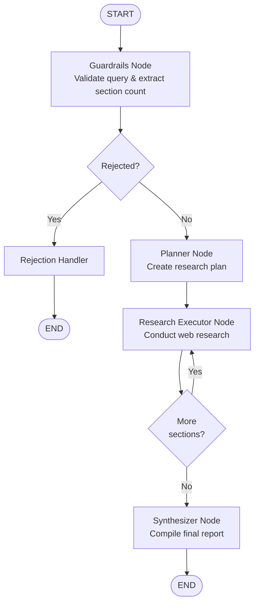
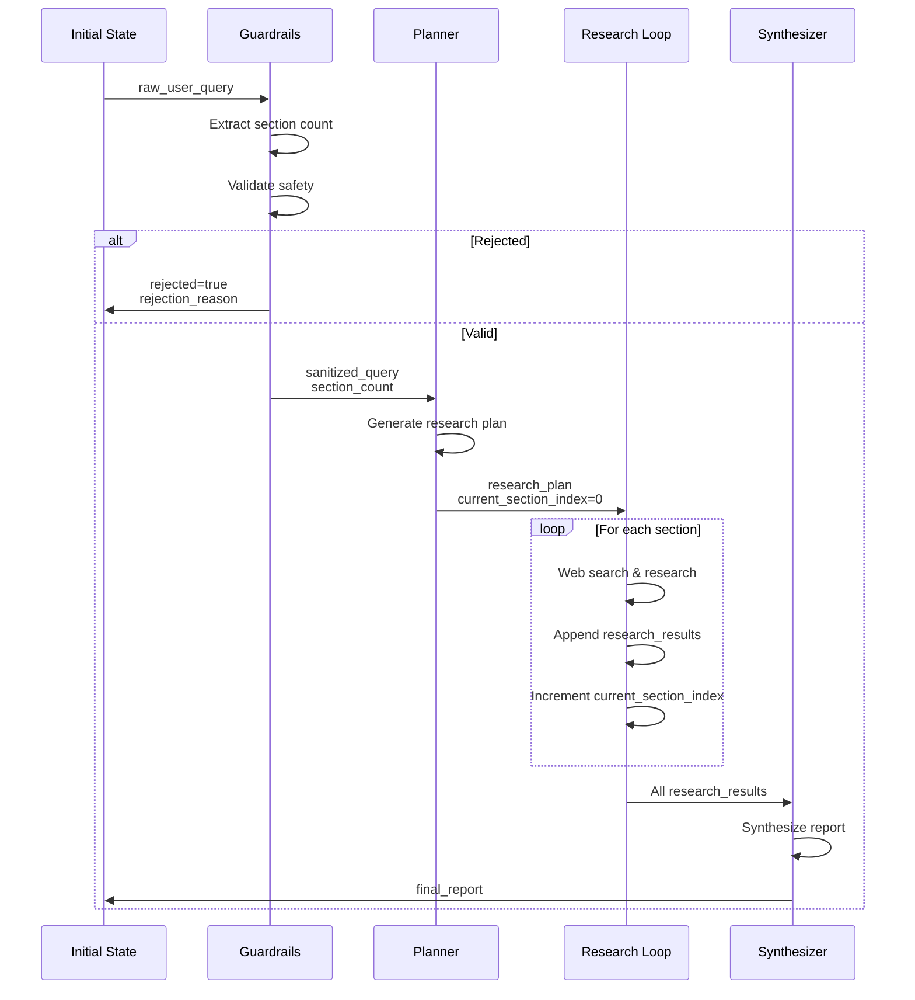
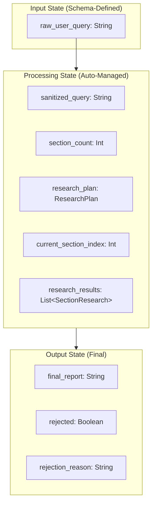
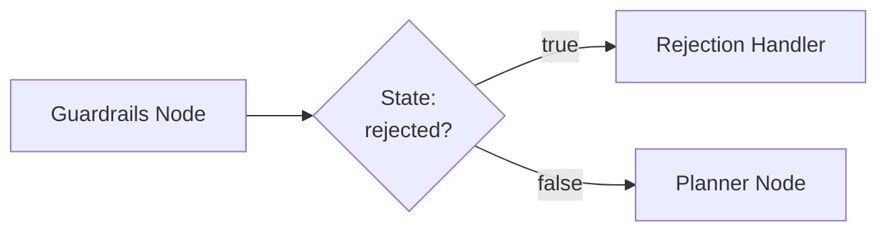
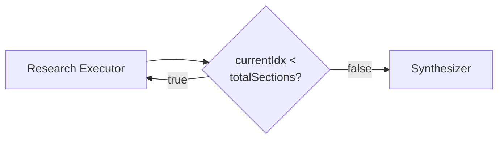

# Research Report Writer

An autonomous agentic workflow that generates comprehensive, well-sourced research reports on any topic by orchestrating
web search tools and LLM reasoning. This example demonstrates patterns for building reliable AI agents
that integrate external tools.

## Overview

This workflow implements a multi-stage research pipeline that:

1. Validates user queries for safety and appropriateness
2. Creates a structured research plan with multiple sections
3. Autonomously conducts web research for each section using the Brave Search API
4. Synthesizes findings into a professional Markdown report with inline citations

**Key Technical Demonstrations:**

- **Tool Calling Integration**: MCP (Model Context Protocol) integration with Spring AI's ToolCallback system
- **Conditional Routing**: Dynamic workflow paths based on validation results and iteration state
- **Loop-Based Execution**: Iterative research across multiple sections
- **Prompt Engineering**: Explicit tool parameter guidance to ensure reliable LLM behavior across model sizes
- **Token Management**: Proper context window and output limit configuration for tool-calling workflows
- **Production Patterns**: Graceful error handling, state management, and structured output validation

## Architecture

The workflow uses LangGraph4j to implement a stateful, conditional execution graph:



**State Evolution:**

The state progressively builds up as the workflow executes:



**Key Points:**

- Minimal initial state (only `raw_user_query`)
- Each node adds specific state keys
- Loop accumulates results in `research_results`
- Final state contains either `final_report` or `rejection_reason`

## Key Components

### State Management

The `ResearchReportState` class extends LangGraph4j's `AgentState` to provide type-safe access to workflow state. The
schema uses a minimalist approach: only input keys are explicitly defined, while output keys use the default "last write
wins" behavior.



**State Schema (Minimalist Approach):**

```kotlin
val SCHEMA: Map<String, Channel<*>> = mapOf(
    RAW_USER_QUERY_KEY to Channels.base<String>({ _, o2 -> o2 }, { "" }),
)
```

Only the input key is defined in the schema; all other keys use the default "last write wins" behavior, reducing
boilerplate while maintaining type safety through accessor methods.

**Complete State Keys:**

- **raw_user_query**: Original user query (schema-defined input)
- **sanitized_query**: Query after validation and preprocessing
- **section_count**: Number of sections to generate (3–5, default 4)
- **research_plan**: Structured plan (ResearchPlan object)
- **current_section_index**: Loop iteration counter (0-based)
- **research_results**: Accumulated findings (List<SectionResearch>)
- **final_report**: Synthesized markdown report
- **rejected**: Boolean rejection flag
- **rejection_reason**: Human-readable explanation

### Workflow Nodes

Each node implements the `NodeAction<ResearchReportState>` interface and returns a map of state updates.

#### 1. GuardrailsNode

**Purpose**: Content validation and query preprocessing

This node serves as the workflow's first line of defense, performing two critical functions:

1. **Section Count Extraction**: Uses regex to identify section count specifications (e.g., "with 5 sections") and
   enforces a 3–5 section limit with a default of 4
2. **Content Safety Validation**: Leverages an LLM to detect:
   - Harmful, offensive, or inappropriate content
   - Prompt injection attempts
   - Nonsensical or impossible-to-research queries
   - Requests for illegal or unethical information

The validation uses structured output (BeanOutputConverter) with explicit JSON examples to ensure reliable parsing
across different model sizes.

**Inputs**: `raw_user_query`

**Outputs**: `sanitized_query`, `section_count`, `rejected`, `rejection_reason`

**External Tools**: None (LLM-only validation)

#### 2. RejectionHandlerNode

**Purpose**: User-friendly rejection handling

Rather than throwing exceptions, this node provides a polite, informative rejection message explaining why the query
cannot be processed. This creates a better user experience and maintains workflow completion semantics.

**Inputs**: `rejection_reason`

**Outputs**: `final_report` (formatted rejection message)

**External Tools**: None

#### 3. PlannerNode

**Purpose**: Research structure generation

This node transforms the validated query into a concrete research plan using structured LLM generation. The plan ensures
comprehensive coverage by:

- Generating exactly `section_count` sections (from guardrail node)
- Creating 2–4 focused research questions per section
- Identifying 3–5 key topics/keywords to guide search queries
- Defining an overall research objective

The node uses `BeanOutputConverter` with explicit JSON examples in the prompt to ensure reliable structured output
generation. This pattern proved critical for getting consistent results from both local (20B) and cloud (120B) models.

**Inputs**: `sanitized_query`, `section_count`

**Outputs**: `research_plan` (ResearchPlan object), `current_section_index=0`

**External Tools**: None

#### 4. ResearchExecutorNode

**Purpose**: Autonomous web research execution

This is the workflow's most complex node, demonstrating reliable LLM tool calling through careful prompt engineering.
For each section in the research plan, the node:

1. Retrieves section details (title, research questions, key topics)
2. Constructs a prompt with explicit tool usage instructions
3. Enables the LLM to autonomously call `brave_web_search` via MCP
4. Captures the LLM's markdown-formatted research output
5. Implements graceful degradation if search fails

The key innovation here is **explicit tool parameter guidance** in the prompt. Rather than relying solely on the tool
schema, the prompt includes:

- Exact parameter specifications with concrete values
- A complete example tool call showing the proper JSON structure
- Specific warnings about common pitfalls (e.g., `ui_lang: "en-US"` not `"en"`)

This approach enabled reliable tool calling even with local 20B models, which initially struggled with generating valid
tool call JSON.

**Inputs**: `research_plan`, `current_section_index`, `research_results`

**Outputs**: Appended `research_results`, incremented `current_section_index`

**External Tools**: brave_web_search (via MCP)

**Tool Usage Pattern** (excerpt from prompt):

```
**IMPORTANT - Tool Usage Instructions:**
When using the brave_web_search tool, you MUST use these EXACT parameters:

- query: Your search query string
- count: 10 (number of results)
- offset: 0 (starting position)
- ui_lang: "en-US" (MUST be "en-US", not just "en")
- country: "US" (country code)
- text_decorations: false
- spellcheck: true

Example tool call:
{
  "query": "quantum computing breakthroughs 2024",
  "count": 10,
  "offset": 0,
  "ui_lang": "en-US",
  "country": "US",
  "text_decorations": false,
  "spellcheck": true
}
```

**Critical Discovery:** Do NOT include `null` for optional parameters. The Brave MCP server (Node.js-based)
distinguishes between `null` and `undefined`, and explicitly passing `null` causes validation failures. This was
discovered through debugging schema validation errors and is now explicitly documented in the prompt.

**Token Configuration:**

```kotlin
OllamaOptions.builder()
    .toolCallbacks(tools)
    .numPredict(32768)  // Max output tokens
    .build()
```

With `num-ctx: 65536` in application.yml (total context window).

This generous allocation accommodates:

- Long prompts with detailed tool instructions (~3k tokens)
- Multiple tool call/response cycles (~10k tokens)
- Comprehensive markdown output with citations (~20k tokens)

Insufficient context causes JSON truncation mid-generation, resulting in malformed tool calls like `'{"count=10"}'`
(missing colon) or unintelligible output. This was a key debugging discovery.

#### 5. SynthesizerNode

**Purpose**: Final report compilation

The synthesis node acts as an editor, combining all section research into a cohesive, professional report. It:

- Aggregates markdown content from all research sections
- Generates an executive summary contextualizing the findings
- Ensures a consistent structure and professional tone
- Preserves all inline citations from the research phase
- Formats the output as Markdown

Unlike the research node, this doesn't use tools — it's pure LLM synthesis work, transforming raw research into polished
documentation.

**Inputs**: `sanitized_query`, `research_results`

**Outputs**: `final_report` (formatted markdown)

**External Tools**: None

**Token Configuration:**

```kotlin
OllamaOptions.builder()
    .numPredict(16384)  // Sufficient for synthesis
    .build()
```

With the same 64k context window, providing ample room for input (all research sections) and output (final report).

### Conditional Routing

The workflow uses conditional edges for dynamic routing based on state values.

#### Guardrails Decision Point



**Implementation:**

```kotlin
AsyncEdgeAction<ResearchReportState> { state ->
    CompletableFuture.completedFuture(
        if (state.rejected()) "reject" else "continue"
    )
}
// Maps: "reject" → rejection_handler, "continue" → planner
```

#### Research Loop Decision Point



**Implementation:**

```kotlin
AsyncEdgeAction<ResearchReportState> { state ->
    val currentIdx = state.currentSectionIndex()
    val totalSections = state.researchPlan().sections.size
    CompletableFuture.completedFuture(
        if (currentIdx < totalSections) "loop" else "done"
    )
}
// Maps: "loop" → research_executor, "done" → synthesizer
```

## Usage

Run the example with the default query:

```bash
examples run ResearchReportWriter
```

Or provide a custom query:

```bash
examples run ResearchReportWriter "Recent advances in quantum computing with 5 sections"
```

### Model Requirements

This workflow has been tested with:

- **Local**: `gpt-oss:20b` via Ollama (works well with proper configuration)
- **Cloud**: `gpt-oss:120b-cloud` via Ollama

The key requirements for reliable tool calling:

- Sufficient context window (`num-ctx: 65536` recommended)
- Explicit tool parameter guidance in prompts
- Proper token limits (`numPredict: 32768` for research node)

### Query Format

The system automatically extracts the section count from the query using the pattern:

- "N sections" or "N section" (case-insensitive)
- Valid range: 3-5 sections
- Default: 4 sections if not specified

Examples:

- "History of the internet" → 4 sections
- "Climate change impacts with 3 sections" → 3 sections
- "AI ethics in 5 sections" → 5 sections

## Implementation Patterns

### Tool Integration

The `ResearchExecutorNode` demonstrates how to integrate MCP tools with explicit parameter guidance:

```kotlin
// Combine all tool sources
private val allTools = (tools + toolCallbackProvider.toolCallbacks)
    .sortedBy { it.toolDefinition.name() }

// Build prompt with explicit tool parameter instructions
val researchPrompt = """
    **IMPORTANT - Tool Usage Instructions:**
    When using the brave_web_search tool, you MUST use these EXACT parameters:
    - query: Your search query string
    - count: 10 (number of results)
    - offset: 0 (starting position)
    - ui_lang: "en-US" (MUST be "en-US", not just "en")
    - country: "US" (country code)
    - text_decorations: false
    - spellcheck: true

    Example tool call:
    {
      "query": "quantum computing breakthroughs 2024",
      "count": 10,
      "offset": 0,
      "ui_lang": "en-US",
      "country": "US",
      "text_decorations": false,
      "spellcheck": true
    }
""".trimIndent()

// Pass tools to the chat model
OllamaOptions.builder()
    .toolCallbacks(tools)
    .numPredict(32768)
    .build()
```

### Structured Output Conversion

Using `BeanOutputConverterCache` for efficient JSON schema generation. **Important:** Always include explicit JSON
examples in your prompts alongside the `format` parameter - models are much more reliable when given concrete examples,
and Ollama cloud models don't support JSON schema format parameters.

```kotlin
val planningPrompt = """
    Create a structured research plan...

    Output ONLY valid JSON matching this exact structure:
    {
      "sections": [
        {
          "title": "Section Title Here",
          "researchQuestions": ["Question 1?", "Question 2?"],
          "keyTopics": ["keyword1", "keyword2", "keyword3"]
        }
      ],
      "overallObjective": "Overall research objective statement here"
    }

    Do NOT include markdown formatting, explanatory text, or anything other than valid JSON.
""".trimIndent()

val prompt = Prompt.builder()
    .messages(UserMessage(planningPrompt))
    .chatOptions(
        OllamaOptions.builder()
            .format(beanOutputConverterCache.getConverter(ResearchPlan::class.java).jsonSchemaMap)
            .build()
    )
    .build()

val result = chatModel.call(prompt).results[0].output.text
val plan = beanOutputConverterCache.getConverter(ResearchPlan::class.java).convert(result)
```

### Accumulating Results Across Iterations

To accumulate research results across loop iterations, we use the default "last write wins" channel behavior and
manually build new lists:

```kotlin
// In Schema definition - output keys don't need explicit channel definitions
// They use the default "last write wins" behavior
val SCHEMA: Map<String, Channel<*>> = mapOf(
    RAW_USER_QUERY_KEY to Channels.base<String>({ _, o2 -> o2 }, { "" }),
)

// In ResearchExecutorNode - manually accumulate results
val currentResults = state.researchResults().toMutableList()
val sectionResearch = SectionResearch(
    sectionTitle = section.title,
    markdownContent = result.trim()
)
currentResults.add(sectionResearch)

return mapOf(
    RESEARCH_RESULTS_KEY to currentResults,
    CURRENT_SECTION_INDEX_KEY to (currentIdx + 1),
)
```

This pattern keeps the schema simple while allowing iterative accumulation of results.

### Error Handling

The `ResearchExecutorNode` demonstrates graceful degradation - if web search fails, the workflow continues with a
placeholder:

```kotlin
return try {
    val result = chatModel.call(prompt).results[0].output.text
        ?: error("Chat model returned no output")

    val sectionResearch = SectionResearch(
        sectionTitle = section.title,
        markdownContent = result.trim()
    )
    currentResults.add(sectionResearch)
    mapOf(
        RESEARCH_RESULTS_KEY to currentResults,
        CURRENT_SECTION_INDEX_KEY to (currentIdx + 1),
    )
} catch (e: Exception) {
    println("Warning: Research failed for section '${section.title}': ${e.message}")
    e.printStackTrace()

    // Graceful degradation - return partial results with an error note
    val fallbackResearch = SectionResearch(
        sectionTitle = section.title,
        markdownContent = "_Research could not be completed due to technical issues: ${e.message}_"
    )
    currentResults.add(fallbackResearch)
    mapOf(
        RESEARCH_RESULTS_KEY to currentResults,
        CURRENT_SECTION_INDEX_KEY to (currentIdx + 1),
    )
}
```

This ensures the workflow completes even if individual sections fail, producing a partial report rather than crashing.

## Design Decisions

This section documents the architectural choices and their rationale.

### 1. Guardrails-Based Validation vs. Exception Throwing

**Decision:** Use an LLM-based guardrails node to validate queries, returning structured rejection messages rather than
throwing exceptions.

**Rationale:**

- Maintains consistent workflow completion semantics (all executions reach END state)
- Provides user-friendly, contextual feedback rather than stack traces
- Enables logging and analytics on rejection patterns
- Allows the workflow to handle edge cases without crashing

### 2. Explicit JSON Examples in Structured Output Prompts

**Decision:** Include concrete JSON examples in all prompts that expect structured output, even when using `format`
parameter with JSON schema.

**Rationale:** Both local and cloud models generate more reliable structured output when given concrete examples. The
`format` parameter provides the schema, but examples show the LLM *how* to use it. This dual approach:

- Significantly reduces parsing errors
- Works consistently across model sizes (20B to 120B+)
- Compensates for models with weaker instruction-following

### 3. Explicit Tool Parameter Guidance

**Decision:** Include complete parameter specifications with exact values in the research prompt, rather than relying
solely on tool schemas.

**Rationale:** Tool schemas define structure but not semantics. LLMs frequently generate plausible but invalid values:

- Locale: `"en"` instead of `"en-US"` (validation failure)
- Booleans: Strings `"true"` instead of boolean `true` (type error)
- Optional params: `null` instead of omitting (Node.js `null !== undefined`)

The explicit guidance pattern:

```text
- ui_lang: "en-US" (MUST be "en-US", not just "en")
```

This explicit guidance significantly improved tool call reliability with local models.

### 4. Token Budget Architecture

**Decision:** Allocate 64k context window (`num-ctx: 65536`) with per-node output limits (`numPredict`).

**Rationale:** Tool calling workflows have complex token requirements:

- **Input**: Prompt + tool schemas + previous context
- **Middleware**: Tool call JSON + tool responses
- **Output**: Final generation

The formula `num-ctx ≥ input + tools + numPredict` must hold. With:

- Research node: 3k input + 10k tools + 32k output = 45k minimum
- Synthesis node: 20k input + 16k output = 36k minimum

The 64k allocation provides a safety margin for variability in tool responses.

### 5. Graceful Degradation over Fail-Fast

**Decision:** Research node catches exceptions and inserts placeholder content rather than failing the entire workflow.

**Rationale:**

- Partial research is better than no research
- Enables debugging in production (error messages become part of output)
- Maintains workflow completion metrics
- Allows users to identify specific section failures

### 6. Sequential Section Processing

**Decision:** Research sections sequentially using a loop, not in parallel.

**Rationale:**

- **Simplicity**: A single execution path is easier to debug and reason about
- **Local Ollama**: Most local setups can't handle concurrent large model requests
- **Cost Control**: Prevents runaway parallelism with cloud models
- **Determinism**: Predictable execution order aids debugging

Future enhancement: Could parallelize for cloud deployments with proper rate limiting.

### 7. Markdown-Based Research Output

**Decision:** Store research results as Markdown strings, not structured objects with `findings: List<String>` and
`sources: List<String>`.

**Rationale:**

- **Flexibility**: LLMs are better at generating natural Markdown than perfectly structured JSON
- **Reduces Parsing**: No need to extract citations or structure from LLM output
- **Preserves Formatting**: Inline citations `(Source: URL)` are more readable
- **Simpler Prompts**: "Write markdown" is clearer than "Fill this JSON structure"

This decision traded some structure for reliability and better LLM outputs.

## Lessons Learned: Common Pitfalls and Solutions

This section documents the key challenges encountered during development and how they were resolved. These insights
demonstrate real-world debugging of LLM-based workflows.

### Challenge 1: MCP Tool Parameter Validation Failures

**Symptoms:**
```
JSONRPCError: Invalid enum value. Expected 'en-US' | 'en-AU' | 'de-AT' | ..., received 'en'
```

**Root Cause:** LLMs frequently generate plausible but invalid parameter values when relying solely on tool schemas. For
locale parameters, models often default to simple codes like `"en"` rather than full locale strings like `"en-US"`.

**Solution:** Explicit parameter guidance in prompts with concrete examples:

```kotlin
val researchPrompt = """
    **IMPORTANT - Tool Usage Instructions:**
    When using the brave_web_search tool, you MUST use these EXACT parameters:
    - ui_lang: "en-US" (MUST be "en-US", not just "en")
    ...

    Example tool call:
    {
      "query": "quantum computing breakthroughs 2024",
      "ui_lang": "en-US",
      ...
    }
""".trimIndent()
```

**Impact:** This pattern enabled reliable tool calling even with local 20B models, which initially struggled with tool
call formatting.

### Challenge 2: null vs undefined in MCP Parameters

**Symptoms:** Tool calls with `freshness: null` failed with validation errors, even though `freshness` is documented as
optional.

**Root Cause:** MCP servers (Node.js-based) distinguish between:

- `undefined` (parameter not included in JSON) → valid for optional parameters
- `null` (parameter explicitly set to null) → invalid, triggers schema validation

**Solution:** Explicitly instruct the LLM to omit optional parameters rather than setting them to `null`. The prompt now
avoids mentioning `null` entirely.

**Impact:** Tool validation errors were resolved after removing `freshness: null` from the example.

### Challenge 3: Token Truncation Causing Malformed JSON

**Symptoms:** HTTP 500 errors with messages like:

```
"error":"error parsing tool call: raw='{\"count=10\",\"country\":\"US\"...',
         err=invalid character '\"' after object key:value pair"
```

**Root Cause:** With `num-ctx: 16384` (16k), the model ran out of context mid-generation when:
- Input prompt and tool instructions: ~3k tokens
- Tool responses from web search: ~5–10k tokens
- Attempting to generate output: Would exceed 16k total

The truncation occurred mid-JSON generation, producing syntactically invalid JSON like `{"count=10"}` (missing colon).

**Solution:** Increased the context window to 64k and set explicit output limits:

```yaml
# application.yml
num-ctx: 65536  # Total context window
```

```kotlin
// Per-node configuration
OllamaOptions.builder()
    .numPredict(32768)  // Max output tokens
    .build()
```

**Mathematical Requirement:** `num-ctx` must be ≥ (input tokens + tool response tokens + `numPredict`)

**Impact:** Eliminated all JSON truncation errors. The workflow is now reliably completed with multiple tool calls per
section.

### Challenge 4: Model Capability for Tool Calling

**Symptoms (Initial Testing):**

- Narrative mixed with JSON: `"We need regulatory frameworks.{\"count\":10,...}"`
- Strange token artifacts: `spring_ai_minn...<|end|><|start|>assistant<|channel|>commentary`
- Inconsistent parameter naming

**Root Cause:** Smaller models (<20B parameters) lack robust tool-calling instruction-tuning. They struggle to:

- Separate reasoning from tool calls
- Generate syntactically perfect JSON under all conditions
- Follow complex parameter specifications

**Solution:** Use appropriately sized models with instruction-tuning:

- **Local**: `gpt-oss:20b` (works reliably with explicit prompting)
- **Cloud**: `gpt-oss:120b-cloud` (higher reliability, more expensive)

**Key Insight:** With proper prompting (explicit parameters) and token configuration (64k context), even 20B models
achieve reliable tool calling. The prompt engineering compensates for model limitations.

## Summary: Key Takeaways

This example demonstrates patterns for building autonomous AI agents that integrate external tools. The
key achievements:

**Technical Accomplishments:**

- **Reliable Tool Calling**: Successful tool integration with local 20B models through explicit parameter guidance
- **Robust State Management**: Minimal schema with type-safe accessors for complex multi-stage workflows
- **Production Error Handling**: Graceful degradation enables partial success rather than complete failure
- **Token Budget Mastery**: Proper `num-ctx`/`numPredict` configuration eliminates truncation errors

**Engineering Insights:**

- **Prompt Engineering Matters**: Explicit examples and parameter guidance compensate for model limitations
- **Debugging is Iterative**: The `null` vs `undefined` discovery came from careful error analysis
- **Context Windows are Critical**: Tool calling requires 3-4x the context of non-tool workflows
- **Tradeoffs are Necessary**: Markdown output vs. structured JSON - chose reliability over structure

**Practical Results:**

- Generates 3–5 section research reports with web-sourced citations
- Works reliably with local models (no cloud dependency)
- Handles invalid queries gracefully with user-friendly feedback
- Processes end-to-end in 3–5 minutes for 4-section reports

This workflow serves as a template for building production LLM agents that integrate external APIs while maintaining
reliability and debuggability.

## Related Files

- **Command Class**: `src/main/kotlin/com/github/bsaltz/springai/examples/research/ResearchReportWriter.kt`
- **Graph Service**: `src/main/kotlin/com/github/bsaltz/springai/examples/research/ResearchReportGraphService.kt`
  *(~400 lines demonstrating state management, tool integration, and error handling)*
- **Data Models**: `src/main/kotlin/com/github/bsaltz/springai/examples/research/ResearchReportWriter.kt`
  *(ResearchPlan, Section, SectionResearch, GuardrailsValidation)*

## See Also

- **[House PTR Parser](../house-ptr-parser/index.md)**: Simpler linear workflow (good starting point)
- **[Getting Started](../../development/getting-started.md)**: Development setup and prerequisites
- **[Example Index](../index.md)**: Overview of all examples
